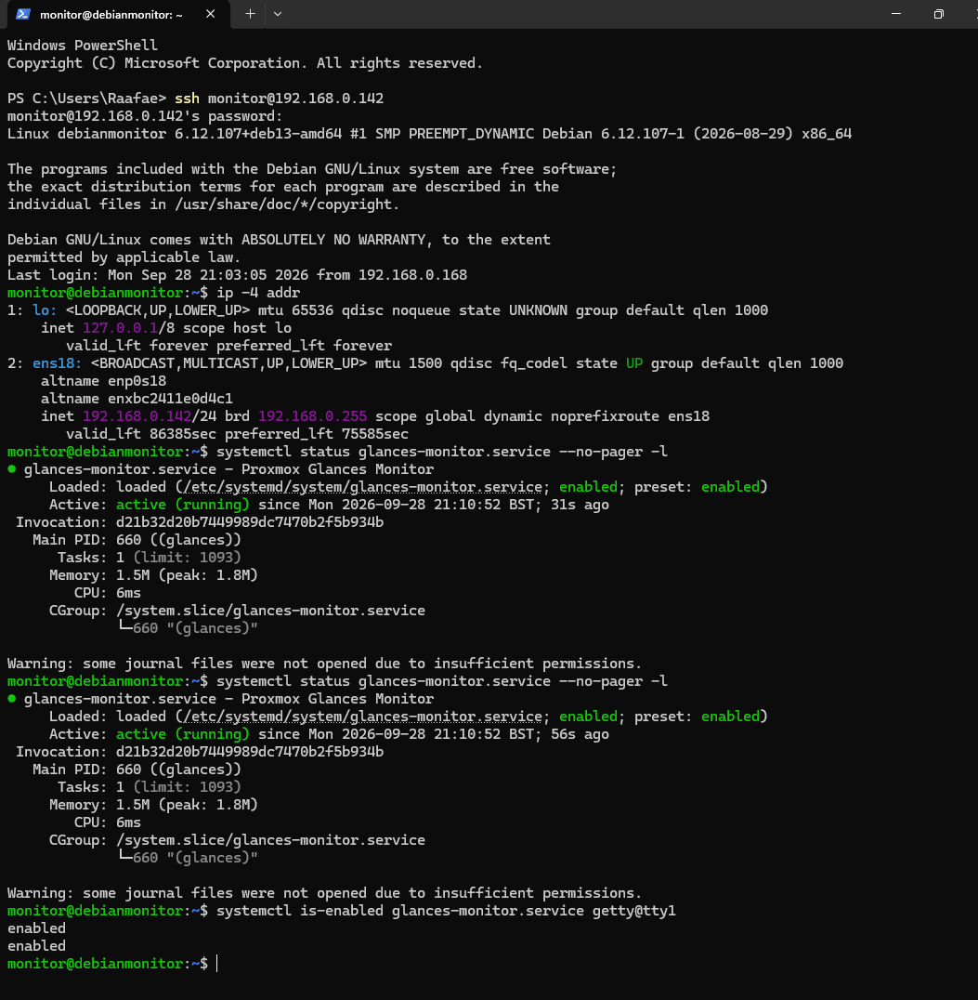
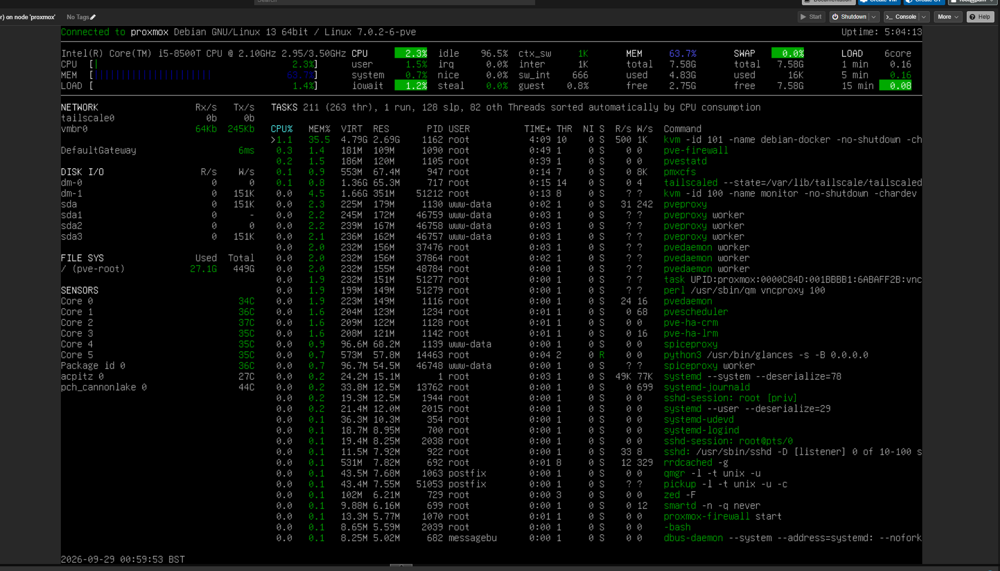

# Proxmox Web Interface Troubleshooting

A real-world homelab troubleshooting case study involving Proxmox VE, Debian, networking, API authentication, Glances and systemd.

## Overview

This project documents the investigation and configuration of a dedicated monitoring system for a Proxmox homelab.

The original setup involved a Debian monitoring VM running on the Proxmox host. The goal was to use a dedicated physical monitor to display the **standard Glances interface for the Proxmox host**, rather than a custom monitoring dashboard.

During the investigation, several issues had to be identified and tested, including:

* Proxmox API authentication
* VM network connectivity
* Glances server/client architecture
* Linux systemd services
* TTY configuration and automatic login
* Terminal behaviour when running Glances over SSH

The final setup uses the monitoring VM as a **Glances client**, connecting to a Glances server running directly on the Proxmox host.

---

## Hardware & Environment

### Proxmox Host

* Dell OptiPlex 3060 Micro
* Intel Core i5-8500T
* 8 GB RAM
* Proxmox VE 7.0.2-6-pve
* Proxmox host IP: `192.168.0.50`

### Monitoring VM

* VM ID: `100`
* Debian GNU/Linux 13 (Trixie)
* 1 GB RAM
* 16 GB virtual disk
* VM IP: `192.168.0.142`
* Glances 4.3.1

### Virtual Networking

The monitoring VM uses a VirtIO network interface connected to the Proxmox `vmbr0` bridge.

```text
Monitoring VM
192.168.0.142
      │
      ▼
VirtIO network interface
      │
      ▼
Proxmox firewall bridge
      │
      ▼
vmbr0
192.168.0.50
```

---

## Screenshots

### Proxmox Glances Server



### Final Glances Monitor


---

## Architecture

```text
                    ┌─────────────────────────┐
                    │     Physical Monitor    │
                    └────────────┬────────────┘
                                 │
                                 ▼
                    ┌─────────────────────────┐
                    │       VM 100            │
                    │   Debian Monitor        │
                    │   192.168.0.142         │
                    │                         │
                    │   Glances Client        │
                    └────────────┬────────────┘
                                 │
                         Glances connection
                                 │
                                 ▼
                    ┌─────────────────────────┐
                    │     Proxmox Host        │
                    │   192.168.0.50           │
                    │                         │
                    │   Glances Server        │
                    └─────────────────────────┘
                                 │
             ┌───────────────────┼───────────────────┐
             ▼                   ▼                   ▼
          VM 100              VM 101          Host system resources
       (CPU/RAM/disk)      (CPU/RAM/disk)     & Proxmox processes
                                               (pveproxy, pvedaemon,
                                                pvestatd, pve-firewall,
                                                Tailscale)
```

The monitoring VM does not query the Proxmox host directly for raw stats — it runs as a Glances **client**, receiving metrics that the Glances **server** on the Proxmox host collects and reports.

---

# 1. Initial Investigation

The first step was checking whether the Proxmox API proxy itself was running.

```bash
systemctl status pveproxy
```

The service was confirmed to be active and running.

This ruled out a completely failed `pveproxy` service as the cause of the monitoring problem.

The Proxmox journal was then inspected:

```bash
journalctl -u pveproxy --no-pager -n 50
```

The logs contained authentication failures involving the monitoring API token.

Example:

```text
authentication failure: invalid token value!
```

and:

```text
is not a valid token ID - not able to split into user and token parts
```

This led to an investigation of the configured Proxmox API tokens.

---

# 2. Proxmox API Token Investigation

The monitoring user was checked with:

```bash
pveum user token list monitor@pve
```

The expected token IDs were present, including:

```text
dashboard
dashboard2
dashboard3
```

The token configuration was also inspected in:

```text
/etc/pve/user.cfg
```

The monitoring VM contained code that was attempting to authenticate against the Proxmox API using:

```text
monitor@pve!dashboard3
```

A direct API request was then performed from the monitoring VM.

Initially, Bash interpreted the `!` character as history expansion, which corrupted the request before it reached the API.

After disabling history expansion, the same authentication request returned:

```text
200
```

This confirmed that:

* The monitoring VM could reach the Proxmox API.
* The API endpoint was responding correctly.
* The `dashboard3` token was valid, and the earlier failures were caused by shell history expansion mangling the request, not by a bad or missing token.

This branch of the investigation was useful for ruling out an API/authentication problem, but it was not what ultimately fixed the monitoring setup — the final solution used Glances directly rather than the Proxmox API (see Section 4).

---

# 3. Verifying VM Networking

The monitoring VM was identified as VM `100`.

```bash
qm config 100
```

Its virtual network interface was:

```text
net0: virtio=BC:24:11:E0:D4:C1,bridge=vmbr0,firewall=1
```

The Proxmox host was then checked to verify that the virtual network interface was actually attached to the bridge.

```bash
bridge fdb show br vmbr0
```

The VM's MAC address was present on the expected bridge interface.

The VM was then accessed directly and its network configuration confirmed:

```bash
ip -4 addr
```

Result:

```text
192.168.0.142/24
```

Connectivity between the VM and Proxmox host was therefore confirmed.

---

# 4. Changing the Monitoring Architecture

The original monitoring VM was running Glances in server mode:

```bash
glances -s -B 127.0.0.1
```

This meant that Glances was monitoring the **Debian monitoring VM itself**.

That was not the desired result.

The goal was instead:

> Physical monitor → monitoring VM → Glances client → Proxmox host's Glances server

Glances supports a client/server architecture, so the monitoring design was changed accordingly: the Proxmox host would run the Glances server and collect its own metrics, while the monitoring VM would run purely as a Glances client displaying those metrics.

---

# 5. Installing Glances on the Proxmox Host

Glances was not initially installed on the Proxmox host.

The Debian package repository was checked:

```bash
apt-cache policy glances
```

Glances `4.3.1` was available.

It was then installed:

```bash
apt install glances -y
```

The installed version was verified:

```bash
glances --version
```

Result:

```text
Glances version: 4.3.1
Glances API version: 4
```

---

# 6. Configuring the Glances Server

The default Glances service initially listened only on localhost:

```text
127.0.0.1:61209
```

This prevented the monitoring VM from connecting.

The systemd service was modified so Glances listened on all interfaces:

```ini
ExecStart=/usr/bin/glances -s -B 0.0.0.0
```

The service was then restarted and verified:

```bash
systemctl daemon-reload
systemctl enable --now glances
```

The listening socket was checked:

```bash
ss -ltnp | grep 61209
```

The final result showed:

```text
0.0.0.0:61209
```

This confirmed that the Proxmox host was accepting Glances connections.

---

# 7. Testing the Glances Client

The old Glances server on VM 100 was disabled:

```bash
sudo systemctl disable --now glances
```

The VM was then used purely as a Glances client.

Running:

```bash
glances -c 192.168.0.50
```

successfully connected to the Proxmox host.

The standard Glances interface displayed:

```text
Connected to proxmox
```

The displayed statistics, collected by the Glances server on the Proxmox host and rendered by the client on the monitoring VM, included:

* Proxmox CPU usage
* Memory usage
* System load
* Network activity
* Processes
* KVM virtual machines
* Proxmox services

This confirmed that the monitoring VM was now displaying data **from** the Proxmox host, rather than monitoring itself.

---

# 8. Automatic Monitor Startup

The final objective was for the dedicated monitor to start Glances automatically without requiring manual commands.

A systemd service was created:

```ini
[Unit]
Description=Proxmox Glances Monitor
After=getty@tty1.service network-online.target
Wants=network-online.target

[Service]
User=monitor
Environment=TERM=xterm-256color
ExecStart=/usr/bin/glances -c 192.168.0.50
Restart=always
RestartSec=5
TTYPath=/dev/tty1
StandardInput=tty
StandardOutput=tty
StandardError=journal

[Install]
WantedBy=multi-user.target
```

The service was enabled:

```bash
sudo systemctl daemon-reload
sudo systemctl enable glances-monitor.service
```

A TTY1 automatic login was also configured for the `monitor` user.

The configuration was verified with:

```bash
systemctl is-enabled glances-monitor.service
systemctl is-enabled getty@tty1
```

Both returned:

```text
enabled
```

The monitor service was also successfully started manually and reported:

```text
Active: active (running)
```

---

# 9. SSH vs Physical Console

During testing, Glances behaved differently depending on how it was launched.

Running the interface through an SSH session resulted in a curses error:

```text
_curses.error: cbreak() returned ERR
```

This was related to the terminal environment provided by the SSH session rather than the Proxmox connection itself.

Running Glances through the VM's console successfully displayed the Proxmox host interface.

This was an important distinction during troubleshooting:

```text
Proxmox connection
        │
        └── Working

Glances client
        │
        └── Working

SSH terminal + curses
        │
        └── Terminal-specific issue
```

---

# 10. Verification

The final configuration was verified from both sides.

### Proxmox host

```bash
ss -ltnp | grep 61209
systemctl status glances --no-pager
```

The Glances server was listening on:

```text
0.0.0.0:61209
```

### Monitoring VM

```bash
ip -4 addr
systemctl status glances-monitor.service --no-pager -l
systemctl is-enabled glances-monitor.service getty@tty1
```

The VM was configured with:

```text
192.168.0.142
```

and the monitoring service was active and enabled.

### Final Glances interface

The client successfully displayed:

```text
Connected to proxmox
```

along with the Proxmox host's system statistics and running virtual machines.

---

# Lessons Learned

This troubleshooting process reinforced several useful Linux and infrastructure concepts:

* Check service state before assuming a service is broken.
* Use logs to identify whether an error is service-level, authentication-level or application-level.
* Verify network connectivity independently from application behaviour.
* Understand the difference between a monitoring server and monitoring client.
* Check where a service is listening before troubleshooting connectivity.
* systemd configuration controls how services start and what environment they run in.
* Terminal-based applications can behave differently over SSH compared with a real TTY.
* Testing each layer independently makes complex infrastructure problems much easier to isolate.

---

# Technologies

* Proxmox VE
* Debian GNU/Linux
* Glances
* systemd
* Linux networking
* VirtIO
* QEMU/KVM
* Proxmox API
* Bash
* SSH
* TTY / getty

---

## Project Status

**Working — software configuration complete, physical validation pending**

The monitoring VM successfully connects to the Proxmox host using the standard Glances interface, and systemd is configured to launch the monitor automatically on the VM.

The remaining step is to connect the dedicated physical display and confirm the complete boot-to-monitor workflow end to end (power-on → TTY1 autologin → Glances client → live Proxmox host data on screen). Until that's been physically verified, this should be treated as software-verified rather than fully verified.

